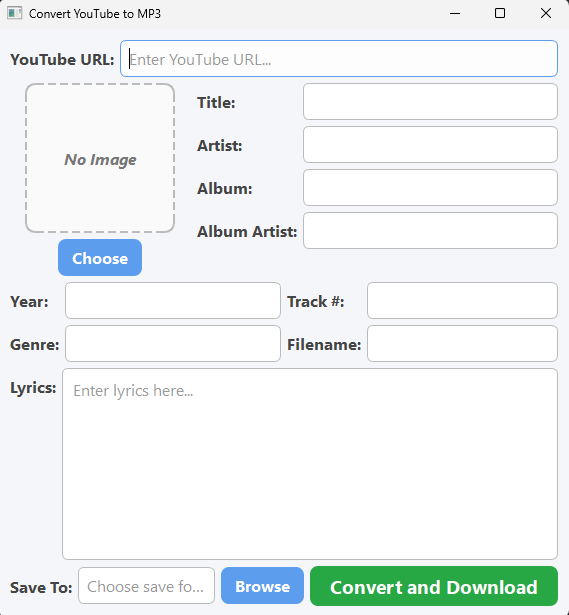

# Youtube to MP3 converter with customizable metadata
With this script you can download audio from any youtube video, convert it to an
mp3 file, add custom metadata such as song title, artist name, album art, etc, and
save the mp3 with your custom metadata to your device to be imported to spotify/apple
music.

## Inspiration:  
I love music and one of my favorite activites is finding music 
from artists that I like that aren't on streaming.  Whether it be a live recording
or an unreleased demo, it always felt like I was uncovering a hidden side to the 
musicians whose music I already loved.  One thing that became a pain though was 
downloading them and having to mannually enter all of the information on
Groove Music (Windows media player's music service at the time).  There
would be random bugs and it was a hassle to download files, then locate them and 
find them on a different software then resave them and finally see them on spotify.
So to make this task easier, I wanted to make a program where the file's metadata can
be edited to include all of the nessecary information(song name, artist, etc) before
its even downloaded onto your computer.  There are some who are fine with the album
art and artist fields as well as others being blank when listening to a local file 
but for some reason not having it look like a song is a silly thing that makes my
brain mad.  So this is pretty much a project intended for personal use (hence the 
oddly specific issue) but I would love it if anyone else could derrive use from
it.

## Requirements for this project:
You need three libraries to create this project (in the same way I did)
- Python3 (the coding language duh :3)
- yt_dlp (for downloading youtube audio)
- ffmpeg (for converting the audio to mp3) 
- mutagen (for tinkering with the metadata)
- PySide6 (for GUI interface, not required)

**yt_dlp & mutagen can be installed on the command line (pip install) but python3 and 
ffmpeg must be donwloaded externally.**

## Installing ffmpeg:
- Go to the official builds page [Here](http://gyan.dev/ffmpeg/builds/)
- download *"ffmpeg-release-essentials.zip"* under 'release builds'
- extract zip file anywhere
- Add ffmpeg to your system PATH!!!!!
    - open extracted folder
    - go to 'ffmpeg\bin' and copy the FULL PATH
    - Search in windows: 'Edit the system enviornment variables'
    - Under 'enviornment variables' find and double click "Path"
    - Click "new" and paste the path you previosuly copied and click OK
- Test by opening command prompt and running 'ffmpeg -version'
- If showing version info, ffmpeg is working.

Don't forget to install the other 2 packages!
- 'pip install yt_dlp'
- 'pip install mutagen'
- 'pip install PySide6'

Beginning the project:  
To start the project, I imported external dependencies
- os
- subprocesses (for ffmpeg)
- YoutubeDl (from yt_dlp)
- MP3 & ID3 (from mutagen.mp3 & mutagen.id3 respectively)

This project is split into 2 main parts
1. Backend (YoutubeMp3.py)
- This file contains most of the logic for the program

2. Frontend (YoutubeMp3Window.py)
- This file contains the GUI
- The GUI was originally built with tkinter but I realized
that even with styling, tkinter looked very primitive so I 
decided to migrate to PySide6, which is basically just a
Qt translator to python

## Backend:
- The download_youtube_audio function:
    -This function takes in the link from youtube and outputs a file called
    "temp.m4a"  This file is the m4a file that we download from youtube 
    before we make the change to MP3.
    - When downloaidng the file, we use ytdl to customize some options for the download
        - 'format: bestaudio/best' simply makes sure we are downloading the best audio possible
        from the video (m4a)
        - 'outtmpl: output_filename' is simply saying the name the file will have after being 
        converted to an m4a file
        - 'quiet: False' shows the download progress
        The postprocessors are run after the video/audio is downloaded
        What these postprocessors are doing specifically is directing the program on how to output the file.
        - 'FFmpegExtractAudio' signifies that we just want the audio
        - 'preferredcodec' defines what audio format we want it in (m4a is best from youtube)
        - '192' is the aimed kbps quality of the audio

- The to_mp3 function:
    - After downloading the youtube video as an m4a file, the 'to_mp3' function converts the m4a audio 
    file into an mp3 using ffmpeg.

- The add_metadata function:
    - After we have the mp3, the 'add_metadata' function will promt the user to input the
    metadata for the song
        - Song name
        - Artist name
        - Album name
        - Album artist
        - Year released
        - Genre
        - Track Number
        - Lyrics
        - Cover Art
    - Every field is optional in case you do not want to give your file information and you
    simply want to download it.

## Frontend:
for the frontend I wanted to implement something simple yet visually more modern
and overall just a little prettier than the default Qt look.
I decided to format the page like this:

  
For styling I used qss (which is just css but for Qt)
My IDE (Vscode) doesn't recognize qss as a valid language and will default
to reading your code as a plaintext file.  This is fine and it will still
work but for readability sake I'd reccomend telling Vscode to read it like css.
Here's how:
- Open your qss file
- At the bottom right of your IDE you should see how the IDE is reading your file
    - for me it was reading as '{} Plain Text'
- Click that and select 'Configure File Association for .qss'
- Then type/select CSS

Running the Project:
Once you have the code and all of the dependencies, the way to actually run the program
is to simply open the python file using the terminal
- `python YoutubeMp3Window.py`

Once greeted with GUI, enter all information and your mp3 will be downloaded to your device.
TIP: I usually select my downloads folder as destination then move them to my localfiles 
folder afterwards because spotify has a wierd bug where when a new file is introduced directly
into where it searches for local files, it kinda bugs out and doesn't recognize it.

Making this project was very fun and I got to gain some very interesting experience in 
python GUI creation.  I've only ever used tkinter before when it comes to python interfaces
so it was neat learning a new method of styling python and I'll definitely be using PySide6
again for future python projects.
